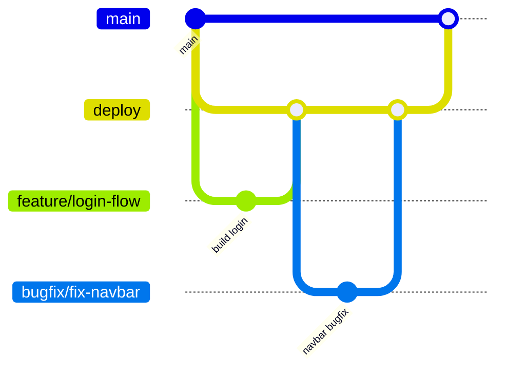

# Contributing to Exam Arena

This document defines how to contribute safely and consistently.

## Core Rules

- Do not push directly to `main`.
- Do not push directly to `deploy` unless it is an approved emergency.
- Every change should come through a Pull Request.
- Keep Pull Requests focused and reasonably small.
- Link each Pull Request to an issue or task whenever possible.

## GitHub Branch Architecture

Use this branch strategy for all work:

- `main`: production-ready branch.
- `deploy`: integration/staging branch for merged features before release.
- `feature/<name>`: new features.
- `bugfix/<name>`: non-critical bug fixes.
- `hotfix/<name>`: urgent production fixes.
- `docs/<name>`: documentation-only changes (optional but recommended).

If your team prefers another name, `deploy` can be renamed to `staging` or `develop`. Keep exactly one long-lived integration branch.



## Branch Naming Convention

- `feature/<short-kebab-case-description>`
- `bugfix/<short-kebab-case-description>`
- `hotfix/<short-kebab-case-description>`
- `docs/<short-kebab-case-description>`

Examples:

- `feature/exam-attempt-flow`
- `bugfix/timer-reset-issue`
- `hotfix/login-token-expiry`

## Development Workflow

1. Update your local branches:

```bash
git checkout deploy
git pull origin deploy
```

2. Create your working branch from `deploy`:

```bash
git checkout -b feature/your-feature-name
```

3. Implement changes and run quality checks:

```bash
npm run lint
npm run build
```

4. Commit using clear commit messages.

Recommended format:

- `feat: add exam submission API`
- `fix: correct question pagination`
- `docs: update setup instructions`

5. Push and open PR:

- PR 1: your branch -> `deploy`
- PR 2 (release PR): `deploy` -> `main`

## Pull Request Checklist

Before requesting review, confirm:

- [ ] Branch name follows convention.
- [ ] Code is linted and builds successfully.
- [ ] Changes are scoped to one feature/fix.
- [ ] README/SETUP/FEATURES docs are updated if behavior changed.
- [ ] PR description explains what changed and why.

## Review and Merge Rules

- At least one reviewer approval for `deploy`.
- At least one senior reviewer approval for `main` release PR.
- Squash and merge is recommended to keep history clean.
- Rebase or merge `deploy` before opening release PR.

## Hotfix Process

1. Create `hotfix/*` from `main`.
2. Open PR into `main` and merge quickly after review.
3. Back-merge the same hotfix into `deploy` so branches stay aligned.

## Keep Documentation Updated

If you change architecture, setup steps, or roadmap status, update:

- `README.md`
- `SETUP.md`
- `FEATURES.md`
