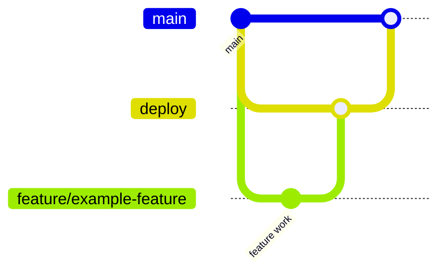

    # Exam Arena

Exam Arena is a full-stack exam platform project built with Next.js, TypeScript, and Prisma.

This repository is now organized with dedicated documentation for setup, features, and contribution workflow.

## Project Docs

- [SETUP.md](SETUP.md) - local setup, environment, and run commands.
- [FEATURES.md](FEATURES.md) - implemented features and roadmap.
- [CONTRIBUTING.md](CONTRIBUTING.md) - contribution rules, PR process, and branch strategy.

## Tech Stack

- Next.js 16 (App Router)
- React 19
- TypeScript 5
- Prisma 7 with PostgreSQL
- ESLint 9

## Quick Start

```bash
npm install
cp .env.example .env
npx prisma generate
npm run dev
```

App runs at `http://localhost:3000`.

For full setup, see [SETUP.md](SETUP.md).

## Branch Architecture (GitHub)

This project follows a simple, team-friendly branching model:

- `main` - production-ready code only.
- `deploy` - integration/staging branch.
- `feature/*` - feature branches created from `deploy`.
- `bugfix/*` - bug fix branches created from `deploy`.
- `hotfix/*` - urgent production fixes created from `main`.



Detailed workflow is documented in [CONTRIBUTING.md](CONTRIBUTING.md).

## Folder Structure

```text
.
|- prisma/
|  |- schema.prisma
|- public/
|- src/
|  |- app/
|  |- components/
|  |- generated/
|  |- hooks/
|  |- lib/
|  |- store/
|  |- types/
|- FEATURES.md
|- CONTRIBUTING.md
|- SETUP.md
|- README.md
```

## Status

Current state: foundation setup is in place and ready for feature development.
