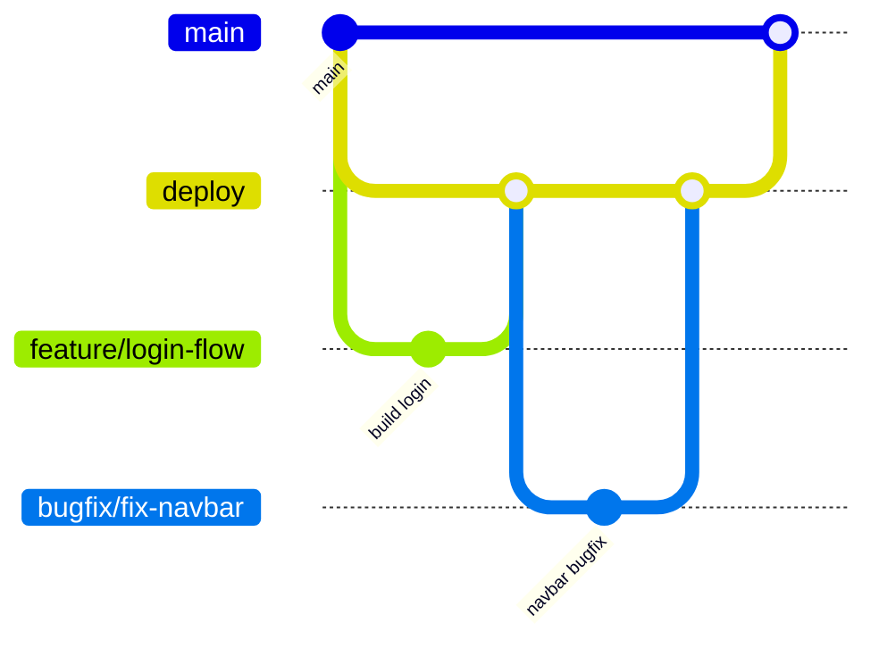

# Contributing to Exam Arena

This document defines how to contribute safely and consistently.

## Core Rules

- Do not push directly to `main`.
- Do not push directly to `deploy` unless it is an approved emergency.
- Every change should come through a Pull Request.
- Keep Pull Requests focused and reasonably small.
- Link each Pull Request to an issue or task whenever possible.

## GitHub Branch Architecture

Use this branch strategy for all work:

- `main`: production-ready branch.
- `deploy`: integration/staging branch for merged features before release.
- `feature/<name>`: new features.
- `bugfix/<name>`: non-critical bug fixes.
- `hotfix/<name>`: urgent production fixes.
- `docs/<name>`: documentation-only changes (optional but recommended).

If your team prefers another name, `deploy` can be renamed to `staging` or `develop`. Keep exactly one long-lived integration branch.



## Branch Naming Convention

- `feature/<short-kebab-case-description>`
- `bugfix/<short-kebab-case-description>`
- `hotfix/<short-kebab-case-description>`
- `docs/<short-kebab-case-description>`

Examples:

- `feature/exam-attempt-flow`
- `bugfix/timer-reset-issue`
- `hotfix/login-token-expiry`

## GitHub Workflow

### 1. When to Create a New Branch
Always create a new branch before starting any new work (features, bug fixes, document updates, etc.). **Never commit directly to the `main` or `deploy` branches.**

### 2. How to Create a New Branch
First, ensure your local integration branch (`deploy`) is up to date:
```bash
git checkout deploy
git pull origin deploy
```

Then, create and switch to your new branch using the appropriate prefix (`feature/`, `bugfix/`, etc.):
```bash
git checkout -b feature/your-feature-name
```

### 3. Making Changes and Committing
Implement your changes and run quality checks:
```bash
npm run lint
npm run build
```

Commit your changes with clear, descriptive commit messages:
```bash
git add .
git commit -m "feat: add exam submission API"
```

### 4. How to Push the Branch
Push your newly created branch to the remote repository on GitHub:
```bash
git push -u origin feature/your-feature-name
```

### 5. How to Merge
1. Go to the GitHub repository in your browser.
2. Click **"Compare & pull request"** for your recently pushed branch.
3. Target the `deploy` branch as the base for your Pull Request.
4. Fill out the **Pull Request Checklist** in the PR description.
5. Once your PR is approved by at least one reviewer, click **"Squash and merge"** to keep the history clean.
6. Delete the branch on GitHub after merging.

*Note: Releases to production are done by opening a PR from `deploy` -> `main`.*

## Pull Request Checklist

Before requesting review, confirm:

- [ ] Branch name follows convention.
- [ ] Code is linted and builds successfully.
- [ ] Changes are scoped to one feature/fix.
- [ ] README/SETUP/FEATURES docs are updated if behavior changed.
- [ ] PR description explains what changed and why.

## Review and Merge Rules

- At least one reviewer approval for `deploy`.
- At least one senior reviewer approval for `main` release PR.
- Squash and merge is recommended to keep history clean.
- Rebase or merge `deploy` before opening release PR.

## Hotfix Process

1. Create `hotfix/*` from `main`.
2. Open PR into `main` and merge quickly after review.
3. Back-merge the same hotfix into `deploy` so branches stay aligned.

## Keep Documentation Updated

If you change architecture, setup steps, or roadmap status, update:

- `README.md`
- `docs/SETUP.md`
- `docs/FEATURES.md`
