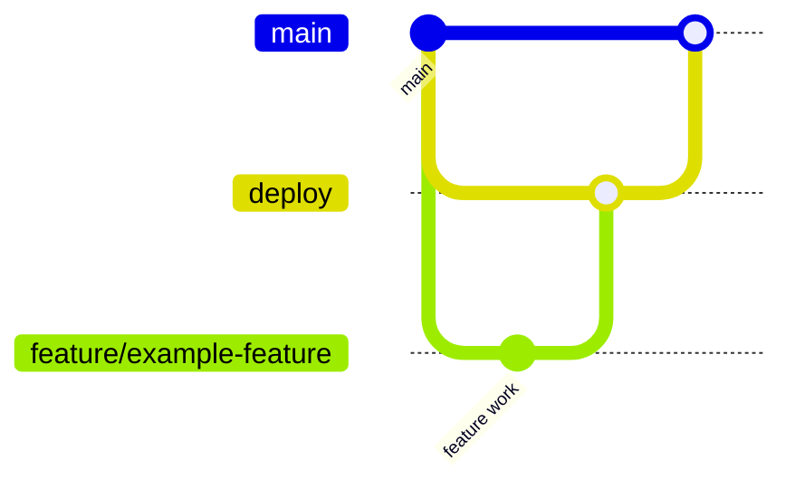

    # Exam Arena

Exam Arena is a full-stack exam platform project built with Next.js, TypeScript, and Prisma.

This repository is now organized with dedicated documentation for setup, features, and contribution workflow.

## Project Docs

- [feature_list.md](feature_list.md) - feature backlog split for team development.
- [docs/SETUP.md](docs/SETUP.md) - local setup, environment, and run commands.
- [docs/FEATURES.md](docs/FEATURES.md) - implemented features and roadmap.
- [docs/CONTRIBUTING.md](docs/CONTRIBUTING.md) - contribution rules, PR process, and branch strategy.
- [docs/commands.md](docs/commands.md) - Docker, Prisma, lint, and Makefile command reference.

## Tech Stack & Rationale

**Frontend**
- **Next.js & React**: Provides server-side rendering for fast initial loads, robust API routes if needed, and a component-based architecture perfect for building complex interactive dashboards for admins and students.
- **Tailwind CSS**: Allows for rapid UI development with utility classes, ensuring a consistent design system without writing massive custom CSS files.
- **Zustand**: Chosen for state management because it is much simpler and less boilerplate-heavy than Redux, perfect for managing the live state of an active exam (timers, current question).
- **React Hook Form**: Handles complex form validation (like creating test papers with multiple options and categories) with high performance and minimal re-renders.
- **Axios**: Used for making clean, promise-based HTTP requests to our FastAPI backend.

**Backend (Python)**
- **FastAPI**: Exceptionally fast, async-native Python framework. It natively supports Python data typing and integrates seamlessly with AI libraries (which are predominantly Python-based).
- **Uvicorn**: An ASGI web server implementation used to run the async FastAPI application.
- **Pydantic**: Enforces strict data validation for incoming API requests (e.g., ensuring a student's submitted answers match the required schema).

**Database & ORM**
- **PostgreSQL**: A highly reliable, relational database. Essential for mapping complex real-world relationships (Schools -> Classes -> Teachers -> Tests -> Student Results) safely and securely.
- **Prisma**: The primary ORM used in this project to define the database schema, handle migrations smoothly, and provide a fully typed database client for the Next.js frontend and API.
- **SQLAlchemy / SQLModel**: Used on the Python backend to securely interact with the same PostgreSQL database.

**Authentication**
- **JSON Web Token (JWT-based auth)**: Provides scalable, stateless authentication across the separate Next.js and FastAPI services without relying on shared server sessions.

**Caching & Background Jobs**
- **Redis**: An in-memory data store used to handle high-frequency reads/writes, such as securely tracking an active test's countdown timer or session state across multiple servers.
- **ARQ (Async Redis Queue)**: A lightweight, async-native background job processor. It elegantly offloads heavy AI/PDF parsing tasks from FastAPI without the massive overhead and complex configuration of Celery.

**File Storage**
- **Cloudflare R2**: Used as an S3-compatible, exceptionally cheap object storage for storing uploaded PDFs (question papers, answer keys) and generated reports natively without bloating the PostgreSQL database.

**Real-Time Communication**
- **Socket.IO / WebSockets**: Enables real-time features like instant teacher-to-student test broadcasts, live proctoring alerts, or notifying a student if they have been disconnected.

**Testing**
- **Vitest**: Provides blazingly fast unit testing for the Next.js frontend components.
- **Playwright**: Handles end-to-end (E2E) testing to ensure critical student exam flows work perfectly in real browsers.
- **Pytest**: Used to rigorously test the FastAPI backend logic and AI integrations.

**DevOps / Infrastructure**
- **Docker & Docker Compose**: Containerizes the frontend, backend, database, and Redis so that any developer can run the entire complex stack on their local machine with a single command (`docker-compose up`), completely avoiding "it works on my machine" issues.
- **GitHub & GitHub Actions**: Hosts the repository and automatically runs CI/CD pipelines (like unit tests and linters) every time code is pushed, ensuring production readiness.

**Monitoring & Logging**
- **Sentry**: Tracks runtime errors and bugs in production so developers can fix them before students notice.
- **Python logging / loguru**: Provides structured, easy-to-read server logs for tracking backend AI evaluation processes and API requests.

## Quick Start

```bash
npm install
cp .env.example .env
npx prisma generate
npm run dev
```

App runs at `http://localhost:3000`.

For full setup, see [SETUP.md](SETUP.md).

## Branch Architecture (GitHub)

This project follows a simple, team-friendly branching model:

- `main` - production-ready code only.
- `deploy` - integration/staging branch.
- `feature/*` - feature branches created from `deploy`.
- `bugfix/*` - bug fix branches created from `deploy`.
- `hotfix/*` - urgent production fixes created from `main`.



Detailed workflow is documented in [CONTRIBUTING.md](CONTRIBUTING.md).

## Folder Structure

```text
.
|- prisma/
|  |- schema.prisma
|- public/
|- src/
|  |- app/
|  |- components/
|  |- generated/
|  |- hooks/
|  |- lib/
|  |- store/
|  |- types/
|- FEATURES.md
|- CONTRIBUTING.md
|- SETUP.md
|- README.md
```

## Status

Current state: foundation setup is in place and ready for feature development.
